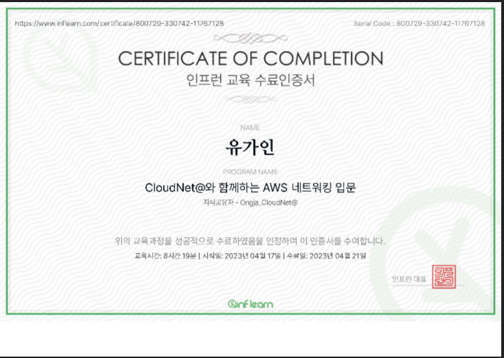

CloudNet@ 팀에서 인프런에 강의를 올려주셨다는 소식을 듣고 재빠르게 수강 신청을 하였다.

평소에 가시다님 스터디에서 도움을 받으며 믿고 듣는 부분이 있었기에 4등으로 신청 성공!

짧은 후기 글을 원하시면 **추천 이유**를 보시고 상세한 후기 글을 원하시면 전체 글을 읽으세요~!

## 추천 이유!

- CloudFormation 템플릿 제공으로 손쉬운 실습 환경 구성 가능
- 강의 화면 자료 및 명령어 제공
- 설명과 실습에 대한 도식화 화면 제공
- 질문에 대한 빠르고 상세한 답변!

## 추천 대상

- 클라우드 네트워크 환경에 대한 지식이 필요한 네트워크 엔지니어
- 클라우드 네트워크 설계에 참고가 필요한 데브옵스 엔지니어
- 클라우드 네트워크에 대해 입문하는 초급 개발자
- 클라우드 네트워크에 관심 있는 학생이나 직장인

추천 대상은 위와 같은 사람으로, 나같은 경우에는 엔지니어를 시작한지 햇수로 2년차가 되었는데 1장은 개념 복기가 되었고 2~5장은 나에게 부족했던 기초를 다지면서 AWS 서비스를 익힐 수 있었다.

**네트워크 지식**이 애매하게 있으면서 **AWS 서비스 입문자**에게 알맞는 강의인 것 같다! *(나처럼)*

그리고 국비지원학원으로 배웠어도 이 강의 듣는걸 추천한다. 나도 국비지원을 다녔지만 초스피드 수업 진도에 반이상도 이해를 못했는데 이 강의는 **도식화 이미지**로 설명해 주시니 머리에 쏙쏙 들어온다~!

## 커리큘럼

이 AWS 네트워킹 입문 강의는 크게 5개의 장으로 구분된다.

- **1장 AWS 글로벌 인프라 (섹션1~5)** : AWS에 대한 전반적인 소개로 AWS가 가지고 있는 글로벌 인프라 설명 & AWS 가입과 EC2 실습
- **2장 Amazon VPC (섹션6~9)** : AWS 네트워킹의 기본 설명 & VPC 실습
- **3장 Amazon VPC 보안 기능 (섹션10~12)** : 네트워크 접근 제어 기능 설명 & 보안 그룹과 ACL 실습
- **4장 Amazon ELB 기능 (섹션13~14)** : 트래픽 부하 분산 기능 & ALB, NLB 실습
- **5장 Amazon Route 53 서비스 (섹션15~17)** : Amazon Route 53 설명 & 실습

### 1장에서는

클라우드 컴퓨팅 개념, 특징, 이점을 온프레미스와 비교하여 알려 주면서,

IaaS/PaaS/SaaS, 퍼블릭/프라이빗/하이브리드 클라우드, 리전 및 가용영역, AWS 서비스 종류, AWS 네트워킹 서비스 종류를 설명해 준다.

클라우드 엔지니어로 일하면서 다시금 기본 개념에 대한 복기를 할 수 있었다.

이번 장에서는 AWS 서비스를 다루기 전에 전반적인 개념을 훑고 가는 느낌으로, CS 지식을 깊게 공부하려는 목적으로는 맞지 않을 것이다.

### 2장에서는

전반적인 네트워킹 설명과 VPC에 관한 설명 및 실습으로 이루어 졌는데, 실습을 하고 나면 그 부분을 단계별로 도식화해서 보여 준다는 점에서 이해가 더 잘됐다.

기본 네트워크 지식으로 VPC, 서브넷, 라우팅테이블의 개념을 각각 알고 있어도 사실상 AWS에서 리소스를 생성하고 삭제하는 순서나 연결되는 부분을 이해하기는 힘들었다.

AWS 새로운 기능인 Resource map로 연결된 서비스 확인하고 강의에서 제공해 주는 단계별로 도식화된 그림으로 내 실습 진행 상황을 육안으로 확인하며 이해할 수 있었다.

### 3장에서는

VPC 보안에 대한 설명과 실습으로 진행된다.

보안 그룹과 네트워크 ACL에 대한 내용인데, 실습을 진행할 때, 보안이 적용됐는지 VPC Flow Logs를 통해 REJECT 로그를 확인하였다. 결과 뿐 아니라 직접 트래픽을 시각화하여 볼 수 있어 속시원(?)했다

게다가 CloudFormation 템플릿도 제공해 주어 보안 실습을 위한 환경은 손쉽게 구성할 수 있었다!

### 4장에서는

ALB와 NLB의 설명 및 실습으로 진행된다.

ALB와 NLB의 차이를 대표적으로 프로토콜 정도는 익히 알고 있었지만 ALB나 NLB에서 Cross-zone load balancing이 default로 설정되어 있는지 없는지의 차이는 이번에 처음 알았다. 사실 Cross-zone LB 기능 자체를 처음 알았다!

이번 LB에 대한 실습도 유익했다. 강의에서 나온 대상 그룹과 리스너 규칙에 대해 잘 이해하고 따라가면 나중에 유용할 것이다.

### 5장에서는

DNS에 대한 기본 설명과 Route 53 실습으로 진행된다.

강의를 듣다가 “도메인 구조 및 DNS 서버 종류” 부분을 듣는데 이직 준비하면서 들었던 “브라우저에 google.com을 입력했을 때 발생하는 일은?” 이라는 질문이 제일 먼저 떠올랐다. 이건 인터뷰 준비가 아니더라도 꼭 들어야 하는 부분이라고 생각한다.

구글링해서 몇 개의 블로그를 보며 이해하는 것보다 이 강의만 본게 단박에 이해가 갔다. 진짜 입문하기 좋은 강의다. (감사합니다 꾸벅(_ _) )

## 마무리

수료증 인증으로 마무리한다!

네트워크에 대한 기본기는 살짝은 있고 AWS 서비스에 입문하는 사람에게 추천한다!

추후에 나올 기본 강의와 중급 강의를 기다리며 후기를 마무리한다~!
